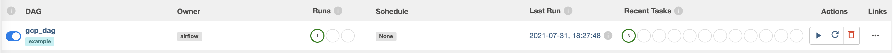

# Example GCP and Airflow operations

Includes:

- **BigQueryToGCSOperator:** To export tables into Google Cloud Storage (example is with partitions).

- **PythonOperator:** Leveraging GoogleCloudStorageHook in a custom function to compose partition text files into one file.

- **GCSDeleteObjectsOperator:** To delete objects from a given bucket and prefix.


## Running locally:

Initialize the Airflow in Docker:

```bash
./init.sh
```

To set your GCP_PROJECT_ID, GCP_BIGQUERY_DATASET_NAME, GCP_BIGQUERY_EXPORT_BUCKET_NAME environment variables, add those lines on the docker-compose.yaml airflow-common service environment:

```
    GCP_PROJECT_ID: '<YOUR-PROJECT-ID>'
    GCP_BIGQUERY_DATASET_NAME: '<YOUR-DATASET>'
    GCP_BIGQUERY_EXPORT_BUCKET_NAME: '<YOUR-BUCKET-NAME>'
```

```bash
docker-compose up
```

Then go to [local Airflow.](http://0.0.0.0:8080/)

Go to the configurations to set up your GCP Connection. Please follow [the instructions on the providers documentation.](https://airflow.apache.org/docs/apache-airflow-providers-google/stable/connections/gcp.html)


Run the DAGs on demand and see the pipeline running.


